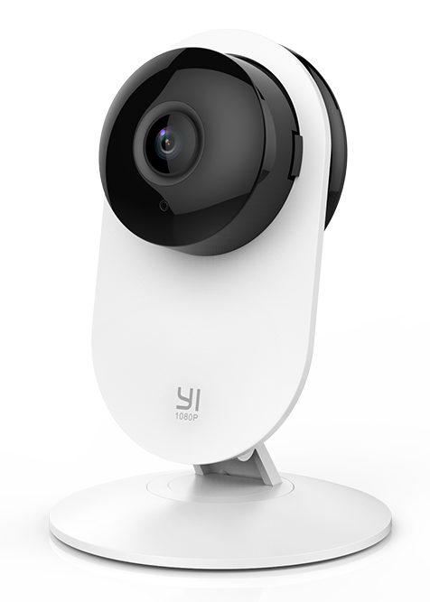

*- for lazy readers, here summarizes what you are looking for -*

||RTSP stream|Use with Mi App|
|---|---|---|
|**[shadow-1/yi-hack-v3](https://github.com/shadow-1/yi-hack-v3)**|**NO**, not possible at the moment|**YES**, full support with proxy|
|**[xmflsct/yi-hack-1080p](https://github.com/xmflsct/yi-hack-1080p)**|**YES**, currently only 720p streaming|**NO**|

# yi-hack-1080p

This project enables Xiaomi Cameras with HiSilicon Hi3518E V200 chipset to have RTSP streaming of live video feed.

Currently this project supports **Yi 1080p Home** camera with firmware version equals or below **2.0.0.1A_201612051401**.

**- NOTE -**

* This project does not support Yi 1080p Home **Version 2**. For the support of V2, please refer to [niclet/yi-hack-v2](https://github.com/niclet/yi-hack-v2).
* This hack will disable cloud usage, following the approach of [fritz-smh/yi-hack](https://github.com/fritz-smh/yi-hack).
* If you would like to have cloud accessibility, please refer to this awesome project [shadow-1/yi-hack-v3](https://github.com/shadow-1/yi-hack-v3).
  * The above project will enable you to use full functionality with official mobile application. However, RTSP streaming is currently not possible with the official approach.
  * The above project will upgrade your firmware to a version above that can be supported with this hack. A downgrade is possible, but need some extra effort.

## Features

This hack includes :
* No more official cloud features.
* RTSP server activated (currently only streaming 720p).
* Telnet server activated
* FTP server activated

## Getting Started

**! MicroSD card must stay in the camera for this hack to function !**

### Prepare the microSD Card

1. Clone this repository onto computer:
  * git clone https://github.com/xmflsct/yi-hack-1080p.git
2. Format a microSD card in FAT32 format and copy the content inside `sd` folder onto root of microSD card.
  * In the root of microSD will contain a folder named `test`.
3. Update your WiFi setting in `/test/wpa_supplicant.conf` on your microSD card.
4. Update settings in `/test/yi-hack-1080p.cfg` if neccesary. Normally if you use DHCP for WiFi connection, you would just need to update your timezone information in the file.

### Starting your Camera

1. If the camera is plugged in, unplug the camera.
2. Insert the microSD card containing updated `test` folder.
3. Plug in the camera.

Then the camera will start up, running hack script if your camera's firmware version meets requirements. After plugging in the camera for around 20 seconds, the LED's color might indicate following situations:
* LED stays yellow, and turns into flashing blue
  1. Most probably, you have a firmware version that is higher than the required one.
* LED stays yellow
  1. The hack works! Now try to telnet to the camera and see if it works.
  2. The hack does not work, and the camera stucks during booting process. In this situation, a serial connection to the camera board is required to debug further the problem.

## Using the Camera

### Telnet Server

The telnet server is on port 23.

Default user is root, and the password is set in `/test/yi-hack-1080p.cfg`.

### FTP Server

The FTP server is on port 21.

No authentication is needed, you can login as anonymous.

### RTSP Server

The RTSP server is on port 554.

You can connect to live video stream (currently only supports 720p) on:
* rtsp://your-camera-ip/ch0_0.h264

## Acknowledgments

Great thanks to the following project which inspires this project, as well as my other 720p camera which is in production mode at the moment.

[fritz-smh/yi-hack](https://github.com/fritz-smh/yi-hack)

Special thanks to the following people and their projects that actually make this project possible!

[shadow-1](https://github.com/shadow-1) and their project [shadow-1/yi-hack-v3](https://github.com/shadow-1/yi-hack-v3), which currently supports another approach of hacking this type of camera due to the specifications of currently RTSP implementation. We hope to combine our projects in the near future when both RTSP and offcial approach can be utilized at the same time.

[andy2301](https://github.com/andy2301) and their development of the RTSP sever used in this project. We are working hard to see if there could be way to make RTSP and official application to co-exist, and most importantly to support 1080p streaming.
